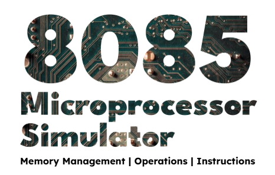

# 8085 Microprocessor Emulator



An Object-Oriented Programming project to emulate the Intel 8085 microprocessor, providing a virtual environment for assembly programming, debugging, and learning.

An emulator is a computer hardware or software mechanism that mimics the workings of another mechanism to enable applications made for a system (invariably older or unique hardware) to execute on an alternate. It simulates the original mechanism's architecture, down to the processor, memory, and input and output schemes.
With an 8085 emulator, the goal is to simulate the working of the Intel 8085 microprocessor. This includes:
- Accurately executing 8085 instructions.
- Emulating registers, memory, flags, and instruction cycles.
- Providing a way to load, run, and debug 8085 assembly programs
- Creating a Handy Interface helping Individuals execute / Simulate 8085 Trainer Kit Module with ease and better debugging tools.
The primary objective is to assist users—particularly students and hobbyists—in learning about the 8085 processor, assembling code, and seeing the impact of instructions on processor state without requiring physical hardware.


## Table of Contents
- [Features](#-features)
- [Technologies Used](#-technologies-used)
- [Installation](#-installation)
- [Usage](#-usage)
- [Project Structure](#-project-structure)
- [Testing](#-testing)
- [Future Work](#-future-work)
- [Challenges](#-challenges)
- [Contributors](#-contributors)
- [License](#-license)
- [References](#-references)

## Features
- **Full 8085 Architecture Emulation**:
  - 8-bit registers (B, C, D, E, H, L, Accumulator) and 16-bit pairs (BC, DE, HL).
  - Program Counter (PC), Stack Pointer (SP), and Flag Register (Sign, Zero, Carry, etc.).
  - 64KB memory space with read/write operations.
- **Instruction Set Support**:
  - 246+ instructions including data transfer, arithmetic, logical, branching, and I/O operations.
- **I/O Handling**:
  - Virtual ports for `IN` and `OUT` instructions.
  - Integration with external devices (e.g., Arduino).
- **Debugging Tools**:
  - CLI and ImGUI interfaces.
  - Memory visualization and register state inspection.
- **Cross-Platform**:
  - Runs on Windows, Linux, and macOS.

## Technologies Used
- **Programming Language**: C++
- **GUI Framework**: SDL3 + ImGui
- **Build Tools**: GCC, Visual Studio 2022
- **Debugging**: CLI & VS Debugger

## Documentation
[Link text](https://docs.google.com/document/d/1sN8UcrVmcivcuoLMB6ioAYqtuSoD7xJD-zhuvkPOzJI/edit?usp=sharing)

## Installation
1. **Clone the Repository**:
   ```bash
   git clone https://github.com/yourusername/8085-emulator.git
